

  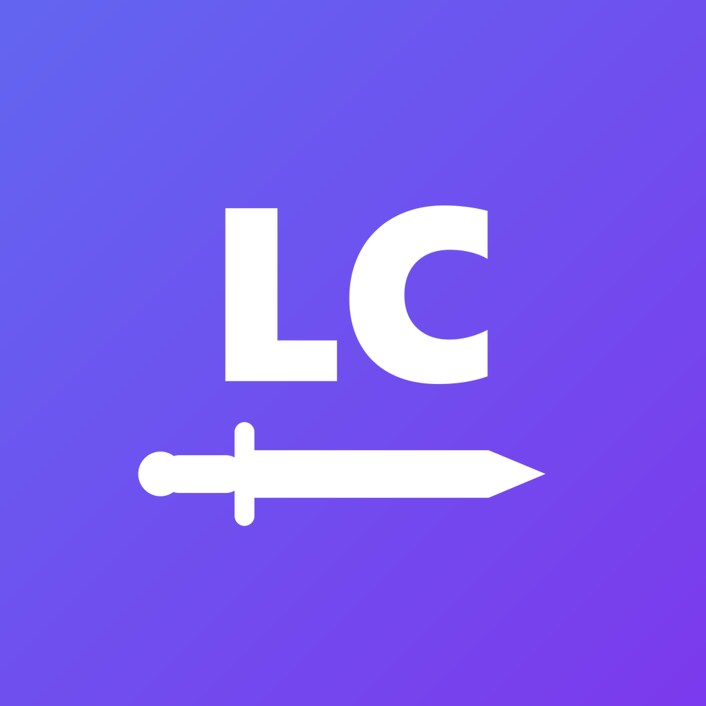

<h1 align="center">LangChall</h1>

  İngilizceyi çeviri yaparak, rakiplerle yarışarak ve Türkiye haritasını fethederek öğreten mobil uygulama.

  
  
  
  
  

> Uygulama geliştirme aşamasında ve henüz yayınlanmadı. Kaynak kodu private bir repoda duruyor. Bu repo projeyi tanıtmak için hazırlandı.

---

## Ekran görüntüleri

  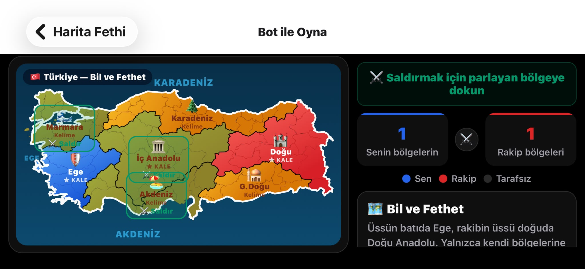
   <em>Bil ve Fethet: bota karşı Türkiye haritasında bölge fethi</em>

| Ana sayfa | Bil ve Fethet | Kapışma |
|:---:|:---:|:---:|
| 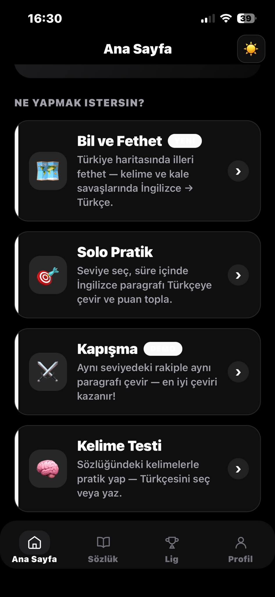 | 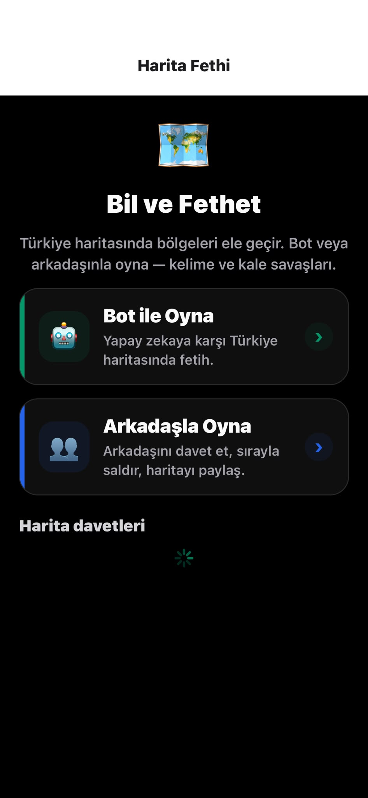 | 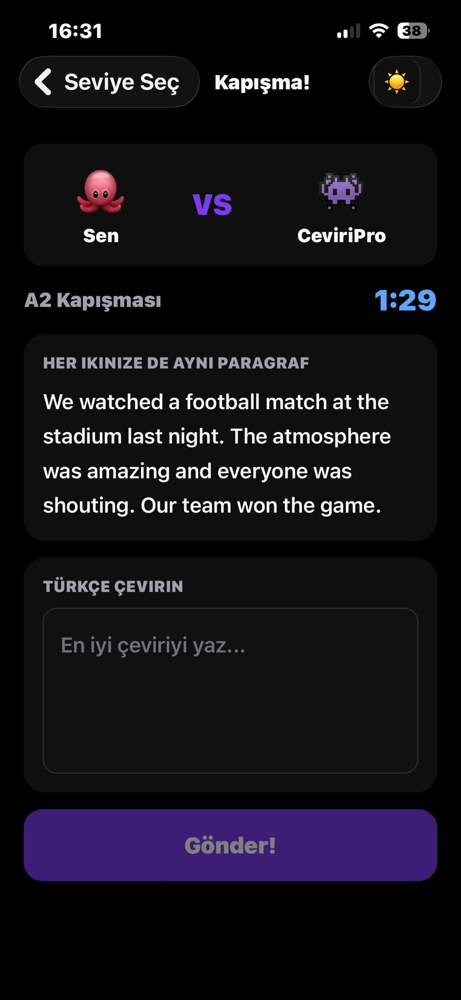 |

| Solo pratik | Kelime testi | Sözlük |
|:---:|:---:|:---:|
| 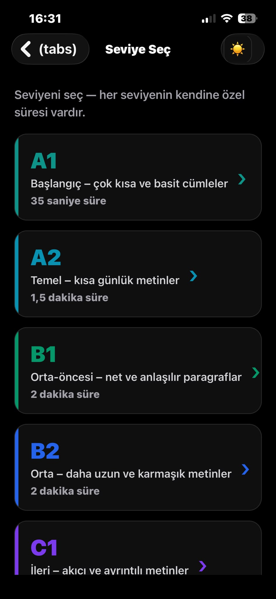 | 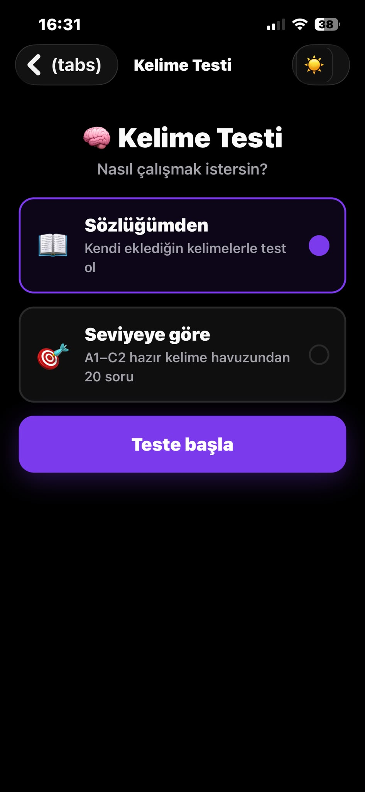 | 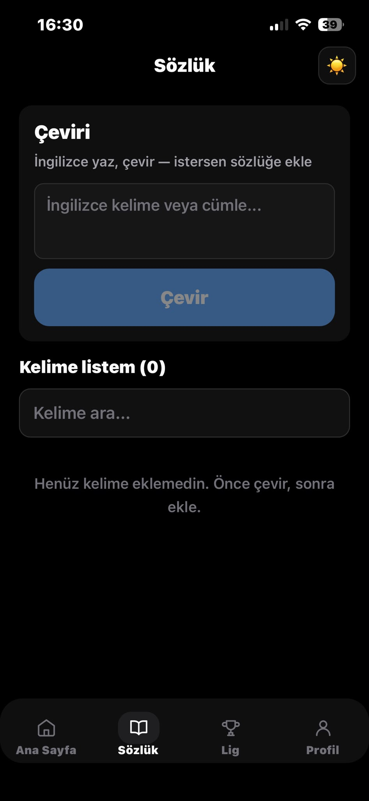 |

| Lig tablosu | Profil | Giriş |
|:---:|:---:|:---:|
| 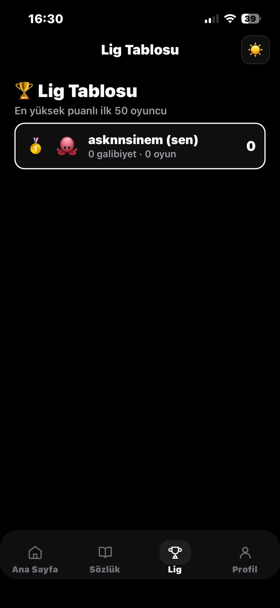 | 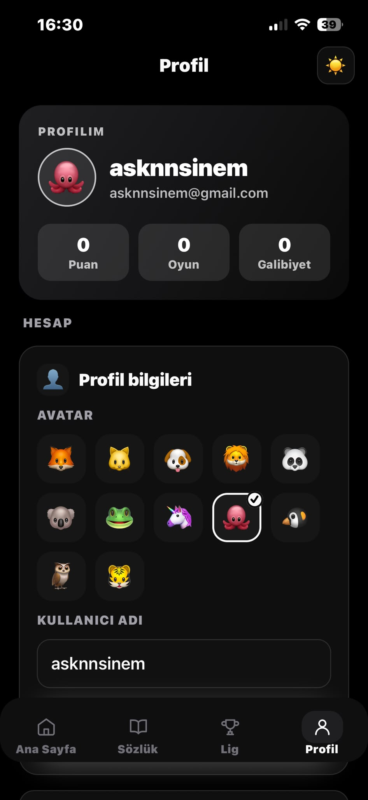 | 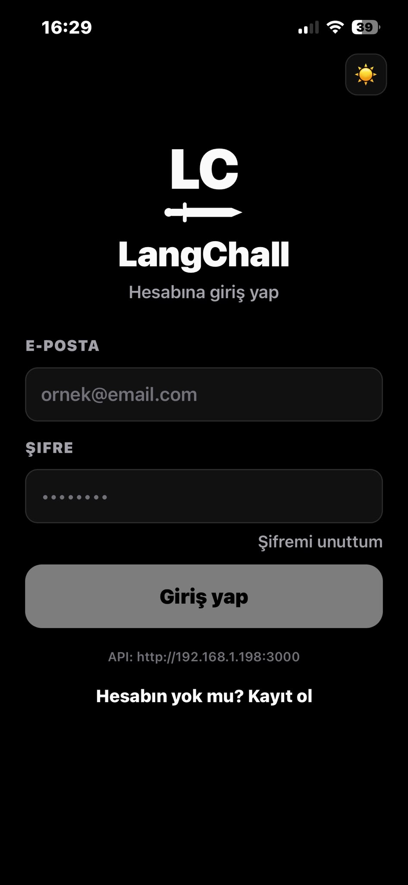 |

🎬 **Demo videosu:** [buraya video linki]

## Oyun modları

### 🗺️ Bil ve Fethet
Türkiye haritasında bota ya da arkadaşına karşı oynanıyor. Kelime ve cümle sorularını doğru cevapladıkça bölge kazanıyorsun, rakibin üssünü alan oyunu kazanıyor.

### 🎯 Solo Pratik
A1'den C2'ye kadar bir seviye seçiyorsun ve süre dolmadan İngilizce bir paragrafı Türkçeye çeviriyorsun. Puan, çevirinin doğruluğuna ve kalan süreye göre hesaplanıyor.

### ⚔️ Kapışma
Aynı seviyedeki iki oyuncu aynı paragrafı çeviriyor (1, 3 ya da 5 tur). En iyi çeviriyi yapan turu alıyor.

### 🧠 Kelime Testi
Okurken bilmediğin bir kelimeye dokununca anlamı açılıyor ve kelimeyi sözlüğüne ekleyebiliyorsun. Kelime testi bu sözlükteki kelimelerden oluşuyor.

**Ayrıca:** arkadaş ekleme, liderlik tablosu, profil ve istatistikler, açık/koyu tema, e-posta ile şifre sıfırlama.

## Çeviriler nasıl puanlanıyor?

Bir cümlenin tek bir doğru çevirisi olmuyor. Kullanıcı eş anlamlı bir kelime kullanabilir ya da kelimelerin sırasını değiştirebilir. Sadece kelime eşleştirmesine bakılırsa doğru çeviriler de düşük puan alıyor. Bu yüzden puanlama iki kısımdan oluşuyor:

1. **Anlam benzerliği:** Kullanıcının çevirisi ve referans çeviri, çok dilli bir sentence-embedding modeliyle (`paraphrase-multilingual-MiniLM-L12-v2`) vektöre çevrilip karşılaştırılıyor. Model sunucuda yerel olarak çalışıyor, dışarıdaki bir API'ye bağlı değil.
2. **Kelime benzerliği:** Ortak kelime oranı ve Levenshtein mesafesi hesaplanıyor. Böylece cümlenin sadece yarısını çeviren biri, anlam benzerliği yüksek çıksa bile tam puan alamıyor.

Toplam puanın 80'i doğruluktan, 20'si kalan süreden geliyor. Embedding modeli bir sebeple çalışmazsa puanlama sadece kelime benzerliğiyle devam ediyor.

## Teknolojiler

| Katman | Kullanılanlar |
|---|---|
| Mobil | React Native (Expo), TypeScript, Expo Router, react-native-svg |
| Backend | Node.js, Express, TypeScript |
| Veritabanı | PostgreSQL |
| Kimlik doğrulama | JWT, bcrypt |
| Puanlama | Transformers.js ile sentence embedding |
| Veri hazırlama | Python script'leri |
| Yayın | Docker, Railway |

## Veri

- **Kelimeler:** Wiktionary'den Python script'leriyle derlenmiş, CEFR seviyelerine (A1–C1) ayrılmış yaklaşık 5.300 kelime. Her kelimenin birden fazla kabul edilen Türkçe karşılığı var.
- **Paragraflar:** Seviyelere göre ayrılmış İngilizce–Türkçe metinler. Aynı kullanıcıya aynı paragrafın kısa sürede tekrar çıkmaması için hangi paragrafın kime gösterildiği kaydediliyor.

## Kaynak kodu

Kodu incelemek isterseniz GitHub kullanıcı adınızı iletmeniz yeterli. Sizi private repoya okuma yetkisiyle eklerim.

**Sinem Aşkın** · [LinkedIn](LINKEDIN_LINKI) · [GitHub](GITHUB_LINKI)
